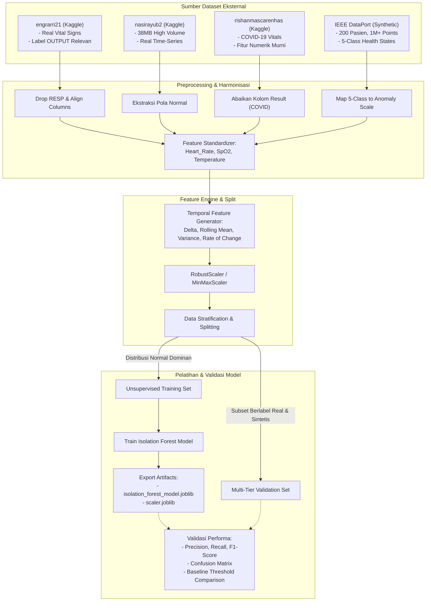

# ARCHITECTURE: Sistem Pemantauan dan Deteksi Anomali Parameter Fisiologis Berbasis IoT

Dokumen ini menjelaskan arsitektur perangkat lunak dan perangkat keras, diagram alur data *end-to-end*, tanggung jawab tiap modul/komponen, serta spesifikasi kontrak payload data.

---

## 1. Diagram Alur Data End-to-End (Mermaid Diagram)

Alur transmisi data dari sensor fisik hingga ditampilkan pada antarmuka *dashboard* dan umpan balik ke perangkat *edge*:

```mermaid
flowchart TD
    subgraph EdgeDevice ["Perangkat Edge: ESP32 Wearable Node"]
        S1["Sensor MAX30102 (PPG, HR, SpO2)"] -->|I2C| ESP32["Mikrokontroler ESP32-WROOM"]
        S2["Sensor DS18B20 (Suhu Kulit)"] -->|1-Wire| ESP32
        
        ESP32 -->|Pengemasan Payload Telemetri| WiFiClient["Wi-Fi Telemetry Transmitter"]
        
        OLED["OLED Display 0.96 inch I2C"]
        Buzzer["Active Buzzer (Local Alarm)"]
        
        ESP32 -->|Update Tampilan Lokal| OLED
        ESP32 -->|Kontrol Status Alarm| Buzzer
    end

    subgraph NetworkTransport ["Lapisan Jaringan Lokal (Wi-Fi LAN)"]
        WiFiClient -->|JSON Telemetry via MQTT / WebSocket| BrokerOrGateway["IoT Ingestion Gateway (Port 1883 / 8000)"]
    end

    subgraph BackendSystem ["Python Backend Server"]
        BrokerOrGateway --> Ingestion["Telemetry Receiver & Validator"]
        
        Ingestion --> SQA["Signal Quality Assessment (SQA)"]
        
        SQA -->|Kualitas Rendah / Kontak Lepas| LowSQARoute["Status: KUALITAS SINYAL RENDAH"]
        SQA -->|Kualitas Baik / Memadai| FeatureEngine["Temporal Feature Fusion Engine"]
        
        subgraph FeatureEngineDetails ["Feature Fusion & Temporal Engine"]
            FeatureEngine --> CalcStats["Kalkulasi Rolling Window: Moving Avg, Variance, Delta, Rate of Change"]
            CalcStats --> FeatureVector["14-Dimensional Feature Vector"]
        end
        
        FeatureVector --> MLInference["Isolation Forest Anomaly Detection"]
        FeatureVector --> BaselineInference["Single-Parameter Threshold Comparator"]
        
        MLInference --> PersistentCheck["Persistent Anomaly Evaluator (Debounce Filter)"]
        BaselineInference -.-> LogComparator["Benchmark Logging & Evaluation"]
        
        PersistentCheck -->|Kombinasi Normal| NormalStatus["Status: NORMAL"]
        PersistentCheck -->|Menyimpang Konsisten (N-Window)| AnomalyStatus["Status: POLA MENYIMPANG"]
        
        NormalStatus --> StatusDispatcher["Status & Feedback Dispatcher"]
        AnomalyStatus --> StatusDispatcher
        LowSQARoute --> StatusDispatcher
        
        StatusDispatcher --> StorageLog["Local SQLite / Time-Series CSV Storage"]
    end

    subgraph FeedbackAndVisualization ["Umpan Balik & Visualisasi"]
        StatusDispatcher -->|JSON Status & Command via Wi-Fi| ESP32
        StatusDispatcher -->|WebSocket Broadcast / SSE Stream| Dashboard["PC Dashboard (Streamlit / Web UI)"]
        
        Dashboard --> LiveCharts["Grafik Time-Series (HR, SpO2, Temp)"]
        Dashboard --> ScoreWidgets["Skor Anomali & Skor SQA"]
        Dashboard --> StatusWidget["Indikator Status & Kesehatan Jaringan"]
    end
```

---

## 2. Komponen Sistem & Tanggung Jawab (Component Responsibilities)

| Layer | Komponen | Tanggung Jawab Utama |
| :--- | :--- | :--- |
| **Edge Hardware** | `MAX30102 Driver` | Membaca sinyal optik PPG (Red & IR LED), mengekstrak estimasi HR dan SpO₂ dasar. |
| | `DS18B20 Driver` | Mengonversi sinyal digital suhu permukaan kulit secara akurat. |
| | `OLED Manager` | Merender teks parameter instan dan status operasional (`NORMAL`, `CEK SENSOR`, `ANOMALI`). |
| | `Buzzer Controller` | Mengatur alarm audio aktif dengan proteksi *fail-safe* dan pemutus otomatis (*time-out*). |
| | `Edge Fail-Safe` | Jika Wi-Fi putus, tetap jalankan pembacaan lokal mandiri tanpa *blocking* / *crash*. |
| **Backend Ingestion** | `Gateway / Receiver` | Menerima paket JSON dari ESP32 via broker MQTT atau endpoint WebSocket/REST. |
| **Signal Processing** | `SQA Service` | Menganalisis stabilitas sinyal PPG, mendeteksi *motion artifact*, dan menentukan apakah data valid untuk ML. |
| **Feature Engineering**| `Feature Fusion Engine` | Mengelola *sliding window buffer* (misal 10–30 sampel) untuk menghitung Delta, Moving Average, Variance, dan Rate of Change secara dinamis. |
| **Machine Learning** | `Isolation Forest Service` | Melakukan inferensi *unsupervised anomaly score* terhadap vektor fitur temporal fisiologis. |
| | `Baseline Comparator` | Membandingkan pembacaan instan terhadap ambang batas sederhana untuk evaluasi riset. |
| | `Persistent Evaluator`| Mencegah *false positive* dengan memastikan anomali bertahan dalam sejumlah *window* pengamatan. |
| **Presentation** | `PC Dashboard` | Menampilkan visualisasi interaktif runtun waktu, skor anomali, status SQA, dan indikator sistem. |

---

## 3. Spesifikasi Skema Data (Data Contracts & JSON Payloads)

### 3.1 Payload Telemetri Sensor: ESP32 $\rightarrow$ Backend Server
Dikirim setiap **1 detik (1 Hz)** via MQTT topik `physio/device/telemetry` atau HTTP POST/WebSocket:

```json
{
  "device_id": "esp32_physio_01",
  "timestamp": 1758804000,
  "raw_sensors": {
    "heart_rate": 78.5,
    "spo2": 98.2,
    "temperature": 32.4
  },
  "sensor_status": {
    "max30102_ok": true,
    "ds18b20_ok": true,
    "ppg_amplitude": 45200
  },
  "network": {
    "wifi_rssi": -62,
    "sequence_id": 1042
  }
}
```

#### Deskripsi Field:
- `device_id` *(string)*: Pengenal unik mikrokontroler.
- `timestamp` *(integer)*: Waktu epoch Unix (detik).
- `raw_sensors.heart_rate` *(float)*: Denyut nadi instan (BPM).
- `raw_sensors.spo2` *(float)*: Saturasi oksigen instan (%).
- `raw_sensors.temperature` *(float)*: Suhu permukaan kulit (°C).
- `sensor_status.max30102_ok` *(boolean)*: Status inisialisasi sensor I2C.
- `sensor_status.ppg_amplitude` *(integer)*: Nilai amplitudo puncak sinyal PPG (indikator kontak kulit).
- `network.sequence_id` *(integer)*: Nomor urut paket untuk memonitor *packet loss*.

---

### 3.2 Payload Umpan Balik: Backend $\rightarrow$ ESP32
Dikirimkan dari backend ke ESP32 via MQTT topik `physio/device/feedback` atau respons WebSocket:

```json
{
  "device_id": "esp32_physio_01",
  "reply_sequence_id": 1042,
  "status": "NORMAL",
  "buzzer_active": false,
  "sqa_status": "GOOD",
  "display": {
    "line_status": "NORMAL",
    "oled_mode": "STANDARD"
  }
}
```

#### Kondisi Status Payload:
- **Kondisi Normal**: `"status": "NORMAL"`, `"buzzer_active": false`, `"display": {"line_status": "NORMAL"}`
- **Kondisi Anomali Konsisten**: `"status": "ANOMALI"`, `"buzzer_active": true`, `"display": {"line_status": "ANOMALI"}`
- **Kondisi Kontak Lepas / Noise**: `"status": "CEK SENSOR"`, `"buzzer_active": false`, `"display": {"line_status": "CEK SENSOR"}`

---

### 3.3 Payload Data Streaming: Backend $\rightarrow$ PC Dashboard
Dikirim secara *push* melalui WebSocket (`/ws/dashboard`) ke antarmuka pengguna:

```json
{
  "timestamp": 1758804000,
  "metrics": {
    "heart_rate": 78.5,
    "spo2": 98.2,
    "temperature": 32.4
  },
  "temporal_features": {
    "hr_delta": 1.2,
    "spo2_delta": -0.1,
    "temp_delta": 0.05,
    "hr_moving_avg": 77.8,
    "spo2_moving_avg": 98.4,
    "temp_moving_avg": 32.35,
    "hr_variance": 2.45,
    "spo2_variance": 0.08,
    "temp_variance": 0.01,
    "rate_of_change": 0.35
  },
  "diagnostics": {
    "sqa_score": 0.94,
    "sqa_state": "GOOD",
    "anomaly_score": -0.12,
    "is_anomaly": false,
    "persistent_anomaly_count": 0,
    "baseline_anomaly": false
  },
  "system": {
    "status": "NORMAL",
    "esp32_online": true,
    "latency_ms": 48
  }
}
```

---

## 4. Struktur Vektor Fitur Machine Learning (Feature Vector Contract)

Model Isolation Forest memproses input berbentuk vektor numerik 1 dimensi dengan 13–14 parameter hasil *Feature Fusion*:

$$\mathbf{X} = [x_1, x_2, \dots, x_{14}]$$

1. $x_1$: `Heart_Rate` (BPM)
2. $x_2$: `SpO2` (%)
3. $x_3$: `Temperature` (°C)
4. $x_4$: `Heart_Rate_Delta` ($\Delta \text{HR}_{t} = \text{HR}_t - \text{HR}_{t-1}$)
5. $x_5$: `SpO2_Delta` ($\Delta \text{SpO2}_{t} = \text{SpO2}_t - \text{SpO2}_{t-1}$)
6. $x_6$: `Temperature_Delta` ($\Delta \text{Temp}_{t} = \text{Temp}_t - \text{Temp}_{t-1}$)
7. $x_7$: `Moving_Avg_Heart_Rate` ($\mu_{\text{HR}}$ window $W$)
8. $x_8$: `Moving_Avg_SpO2` ($\mu_{\text{SpO2}}$ window $W$)
9. $x_9$: `Moving_Avg_Temperature` ($\mu_{\text{Temp}}$ window $W$)
10. $x_{10}$: `Variance_Heart_Rate` ($\sigma^2_{\text{HR}}$ window $W$)
11. $x_{11}$: `Variance_SpO2` ($\sigma^2_{\text{SpO2}}$ window $W$)
12. $x_{12}$: `Variance_Temperature` ($\sigma^2_{\text{Temp}}$ window $W$)
13. $x_{13}$: `Rate_of_Change` (Laju perubahan gabungan normalisasi)
14. $x_{14}$: `Signal_Quality_Score` (Skor kualitas sinyal PPG)

---

## 5. Arsitektur Pipeline Data & Pelatihan Model Multi-Sumber

Untuk mengatasi keterbatasan label dan variabilitas data fisiologis, pipeline machine learning mengadopsi arsitektur pelatihan multi-sumber (*Multi-Source Heterogeneous Pipeline*):



### Strategi Pemisahan Peran Dataset:
1. **`engrarri21`**: Berfungsi sebagai *benchmark ground-truth* data nyata karena memiliki kolom output fisiologis yang dapat dipetakan langsung ke evaluasi biner (*Normal* vs *Abnormal*).
2. **`nasirayub2`**: Berfungsi sebagai penyedia variasi biologis normal (*rich baseline*) untuk mencegah model overfitting terhadap satu rentang sempit.
3. **`rishanmascarenhas`**: Digunakan hanya parameter numeriknya untuk mempertebal matriks fitur training unsupervised tanpa menggunakan label COVID-19.
4. **`IEEE DataPort Synthetic Dataset`**: Berfungsi menguji sensitivitas model terhadap gradasi anomali berjenjang (*Mild*, *Moderate*, *Critical*, *Outlier*) yang dilengkapi variabilitas Gaussian noise realistis.

