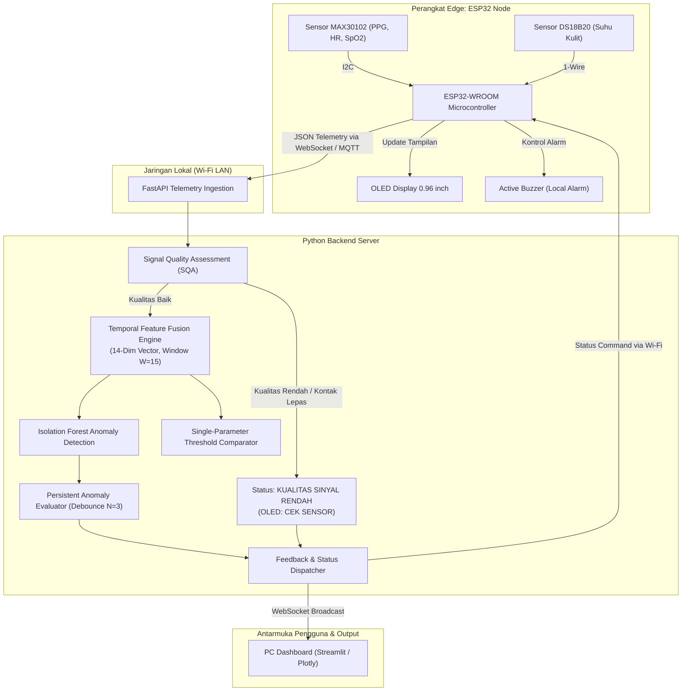

# IoT-based Physiological Parameter Monitoring and Anomaly Detection

[](https://www.python.org/)
[](https://platformio.org/)
[](https://fastapi.tiangolo.com/)
[](https://streamlit.io/)
[](https://scikit-learn.org/)
[]()

> **Sistem Pemantauan dan Deteksi Anomali Parameter Fisiologis Berbasis IoT Menggunakan Sinyal PPG, SpO₂, Suhu, dan Machine Learning**

Sistem prototipe *Internet of Things* (IoT) untuk pemantauan parameter fisiologis manusia secara *real-time* dan deteksi dini (*early-warning*) non-klinis terhadap penyimpangan pola fisiologis multivariat menggunakan pendekatan **Feature Fusion** dan algoritma **Isolation Forest**.

---

> [!IMPORTANT]
> **DISCLAIMER MEDIS**: Sistem ini dirancang sebagai alat penelitian dan prototipe pemantauan *early-warning* **non-klinis**, **BUKAN alat diagnosis medis**. Status "Pola Menyimpang" hanya mencerminkan deviasi statistik dari distribusi normal data latihan, bukan vonis kondisi patologis tertentu (seperti aritmia, hipoksia, demam, dsb).

---

## 📌 Fitur Utama

- **Akuisisi Multi-Sensor Real-Time**:
  - Sinyal optik PPG, estimasi denyut nadi (*Heart Rate*), dan saturasi oksigen (*SpO₂*) via **MAX30102** (I²C).
  - Suhu permukaan kulit via digital sensor **DS18B20** (1-Wire).
- **Signal Quality Assessment (SQA)**:
  - Lapisan verifikasi kualitas sinyal optik PPG untuk memfilter *motion artifact*, pergeseran sensor, dan kontak kulit yang tidak stabil sebelum data diproses oleh model Machine Learning.
- **Multivariate Feature Fusion (14-Dimensi)**:
  - Mengekstrak parameter instan, perubahan dinamika (*Delta*), rata-rata bergerak (*Moving Average*), varians fluktuasi (*Variance*), dan laju kecepatan perubahan (*Rate of Change*) menggunakan *sliding window*.
- **Deteksi Anomali Unsupervised (Isolation Forest)**:
  - Melatih model pada sebaran data normal tanpa memerlukan data abnormal berlabel, menghasilkan skor anomali kontinu dan klasifikasi tri-state: `NORMAL`, `POLA MENYIMPANG`, dan `KUALITAS SINYAL RENDAH`.
- **Anti-False Alarm (Persistent Anomaly Debounce)**:
  - Alarm lokal (*active buzzer*) hanya aktif jika penyimpangan terdeteksi secara konsisten selama sejumlah jendela waktu berturut-turut ($N=3-5$).
- **Umpan Balik Dua Arah & Edge Autonomy**:
  - Layar lokal **OLED I²C (0.96")** menampilkan parameter instan dan status operasional.
  - Mode *standalone fail-safe*: jika koneksi Wi-Fi terputus, ESP32 tetap menampilkan pembacaan sensor lokal di layar OLED.
- **PC Dashboard Interaktif**:
  - Visualisasi grafik *time-series*, indikator *Anomaly Score*, *SQA Score*, dan status konektivitas perangkat secara *live*.

---

## 🏗️ Arsitektur Sistem

Aliran data sistem dirancang secara berjenjang dari perangkat keras tepi (*edge*), transmisi nirkabel, pemrosesan backend, hingga antarmuka visualisasi:



---

## 📁 Struktur Direktori Proyek

```text
├── ARCHITECTURE.md              # Spesifikasi teknis arsitektur & skema payload data
├── FASE_1_REPORT.md             # Laporan lengkap hasil pelatihan & evaluasi model AI
├── PROPOSAL.md                  # Transkripsi Markdown lengkap dokumen proposal asli
├── REQUIREMENTS.md              # Kebutuhan fungsional, non-fungsional, & batasan teknis
├── ROADMAP.md                   # Rencana kerja pengembangan 6 fase
├── SECURITY.md                  # Kebijakan autentikasi, privasi data, & hardware safety
│
├── backend/                     # Layanan Backend API & Inferensi (FastAPI)
│   ├── app/
│   │   ├── main.py              # Entrypoint server & handler WebSocket
│   │   ├── core/config.py       # Pengaturan konfigurasi, ambang SQA, & model path
│   │   ├── schemas/telemetry.py # Model validasi data Pydantic
│   │   └── services/            # Modul logika bisnis: SQA, Feature Fusion, Anomaly Model
│   └── requirements.txt         # Dependensi Python backend
│
├── dashboard/                   # Antarmuka Monitoring Real-Time (Streamlit)
│   ├── app.py                   # Dashboard interaktif, grafik time-series, & gauges
│   └── requirements.txt         # Dependensi antarmuka pengguna
│
├── firmware/                    # Kode Sumber Embedded ESP32 (PlatformIO / C++)
│   ├── platformio.ini           # Konfigurasi board esp32dev & dependencies
│   ├── include/                 # Header konfigurasi pinout, sensor, display, & komunikasi
│   └── src/                     # Implementasi non-blocking scheduler (millis)
│
├── ml_pipeline/                 # Pipeline Pelatihan & Evaluasi Model AI (Offline)
│   ├── data/                    # Dataset hasil harmonisasi & fitur temporal
│   ├── models/                  # Serialisasi model (isolation_forest_model.joblib, scaler.joblib)
│   └── src/                     # Script otomasi: clean_datasets, feature_engineering, train
│
└── tests/                       # Unit & Integration Tests (pytest)
    ├── test_sqa.py              # Pengujian aturan Signal Quality Assessment
    ├── test_features.py         # Pengujian rolling window & 14-dim feature vector
    └── test_model.py            # Pengujian inferensi model AI & persistent evaluator
```

---

## 🔬 Dataset & Hasil Pelatihan AI (Fase 1)

Model dilatih menggunakan gabungan **4 sumber dataset fisiologis** yang telah diharmonisasikan (**291.543 baris data bersih**):
1. **`engrarri21`** (*Human Vital Signs*): Data riil tanda vital dengan label output biner.
2. **`nasirayub2`** (*Human Vital Signs 2024*): Volume besar (200K baris) runtun waktu kontinu untuk sebaran normal.
3. **`rishanmascarenhas`** (*COVID-19 Vitals*): Suplemen numerik (suhu dikonversi dari °F ke °C).
4. **`gourangomandal`** (*IoMT Synthetic Dataset*): 60K baris dengan multi-parameter alert dan metadata kondisi penyakit.

### Hasil Evaluasi Sensitivitas Kondisi Kesehatan:
| Kategori Kondisi | Total Sampel | Terdeteksi Normal | Terdeteksi Anomali | % Deteksi Anomali | Keterangan |
| :--- | :---: | :---: | :---: | :---: | :--- |
| **Healthy (Sehat)** | **11.973** | **11.971** | **2** | **0.02%** | *False Alarm* hampir nol pada orang sehat! |
| **Asthma** | 11.885 | 8.597 | 3.288 | **27.67%** | Sensitif terhadap desaturasi oksigen ($SpO_2$). |
| **Heart Disease** | 12.038 | 9.642 | 2.396 | **19.90%** | Sensitif terhadap takikardia ($HR > 120$ BPM). |
| **Diabetes Mellitus**| 12.164 | 11.822 | 342 | 2.81% | Tanda vital optik berada dalam batas normal. |
| **Hypertension** | 11.926 | 11.696 | 230 | 1.93% | Denyut & oksigen normal (patologi pada tensi). |

*Rincian evaluasi lengkap dapat dibaca pada dokumen [FASE_1_REPORT.md](FASE_1_REPORT.md).*

---

## 🚀 Panduan Memulai (Quickstart)

### 1. Prasyarat Sistem
- **Python 3.10+** (disarankan Python 3.11 atau 3.12/3.13)
- **PlatformIO IDE** (ekstensi VS Code atau PlatformIO Core CLI)
- **Git**

### 2. Kloning Repository
```bash
git clone https://github.com/Rnvz/IoT-based-Physiological-Parameter-Monitoring-and-Anomaly-Detection.git
cd IoT-based-Physiological-Parameter-Monitoring-and-Anomaly-Detection
```

### 3. Menjalankan Pipeline Data & Model AI (Fase 1)
```bash
# 1. Masuk ke direktori pipeline ML
cd ml_pipeline

# 2. Install dependensi
pip install -r requirements.txt

# 3. Jalankan pembersihan data & feature engineering
python src/clean_datasets.py
python src/feature_engineering.py

# 4. Latih model Isolation Forest
python src/train_isolation_forest.py
```

### 4. Menjalankan Server Backend (FastAPI)
```bash
# 1. Masuk ke direktori backend
cd ../backend

# 2. Install dependensi
pip install -r requirements.txt

# 3. Konfigurasi environment lokal
cp .env.example .env

# 4. Jalankan server backend (Uvicorn)
uvicorn app.main:app --reload --host 0.0.0.0 --port 8000
```
*Akses dokumentasi Swagger UI API di: `http://localhost:8000/docs`*

### 5. Menjalankan PC Dashboard (Streamlit)
```bash
# 1. Buka terminal baru dan masuk ke direktori dashboard
cd ../dashboard

# 2. Install dependensi
pip install -r requirements.txt

# 3. Jalankan dashboard
streamlit run app.py
```
*Dashboard akan terbuka secara otomatis di browser pada: `http://localhost:8501`*

### 6. Menjalankan Unit Tests
```bash
# Jalankan seluruh rangkaian unit test dari root folder
python -m pytest tests/ -v
```

### 7. Setup & Flash Firmware ESP32
1. Sambungkan ESP32-WROOM ke port USB laptop.
2. Buka folder `firmware/` di VS Code dengan ekstensi **PlatformIO**.
3. Buat file `firmware/include/secrets.h` dari template:
   ```bash
   cp firmware/include/secrets.h.example firmware/include/secrets.h
   ```
4. Masukkan nama Wi-Fi (`WIFI_SSID`), kata sandi (`WIFI_PASSWORD`), dan IP PC Anda.
5. Jalankan perintah PlatformIO:
   ```bash
   pio run --target upload
   pio device monitor
   ```

---

## 🛠️ Konfigurasi Hardware (Wiring Pinout)

| Komponen / Sensor | Pin ESP32 | Protokol Komunikasi | Deskripsi |
| :--- | :---: | :---: | :--- |
| **MAX30102 SDA** | GPIO 21 | I²C Data | Jalur data sensor denyut & SpO₂ |
| **MAX30102 SCL** | GPIO 22 | I²C Clock | Jalur clock sensor denyut & SpO₂ |
| **OLED 0.96" SDA**| GPIO 21 | I²C Data | Bersama pada bus I²C yang sama |
| **OLED 0.96" SCL**| GPIO 22 | I²C Clock | Bersama pada bus I²C yang sama |
| **DS18B20 Data** | GPIO 4 | 1-Wire | Sensor suhu kulit (pull-up resistor 4.7kΩ ke 3.3V) |
| **Active Buzzer** | GPIO 25 | Digital Output | Alarm lokal peringatan anomali persistent |
| **VCC & GND** | 3.3V / GND | Daya DC | Catu daya sensor dan modul |

---

## 🧪 7 Skenario Pengujian Fisik (Experimental Protocol)

Sistem diuji dalam skenario fisik harian non-klinis untuk mengevaluasi stabilitas sensor, efektivitas SQA dalam menekan *motion artifact*, dan ketahanan algoritma *persistent anomaly*:

1. **Kondisi Istirahat (*Resting Baseline*)**: Menetapkan profil normal fisiologis saat duduk tenang.
2. **Aktivitas Mengetik (*Typing Motion Artifact*)**: Menguji ketahanan sinyal PPG terhadap getaran jari/pergelangan saat mengetik di keyboard.
3. **Aktivitas Fisik Ringan (*Light Activity*)**: Berdiri dan berjalan santai untuk memantau adaptasi laju denyut jantung (*rate of change*).
4. **Perubahan Posisi Tangan (*Hand Position Shift*)**: Menguji kestabilan sirkulasi perifer saat tangan diangkat atau diturunkan.
5. **Variasi Posisi Sensor (*Sensor Placement Shift*)**: Menggeser sensor sedikit ke samping pergelangan untuk menguji toleransi posisi.
6. **Variasi Tekanan Strap (*Strap Pressure Variation*)**: Menguji perbedaan sinyal saat tali strap kendor vs terpasang pas.
7. **Kontak Sensor Tidak Stabil (*Loose Contact Simulation*)**: Melepas atau mengangkat sensor dari kulit untuk memverifikasi apakah sistem berhasil menampilkan status **`CEK SENSOR` / `KUALITAS SINYAL RENDAH`** (bukan alarm anomali medis palsu).

---

## 📖 Dokumentasi Lengkap Proyek

- [PROPOSAL.md](PROPOSAL.md) — Transkripsi lengkap proposal penelitian awal.
- [REQUIREMENTS.md](REQUIREMENTS.md) — Kebutuhan fungsional & non-fungsional mendalam.
- [ARCHITECTURE.md](ARCHITECTURE.md) — Arsitektur detail, diagram data flow, & kontrak payload.
- [ROADMAP.md](ROADMAP.md) — Rencana tahapan pengerjaan dan matriks prioritas tugas.
- [SECURITY.md](SECURITY.md) — Model keamanan siber, privasi data fisiologis, & fail-safe hardware.
- [FASE_1_REPORT.md](FASE_1_REPORT.md) — Laporan teknis hasil komputasi dan evaluasi model Machine Learning.

---

## 👥 Peneliti & Kontributor

- **Pengembang Utama**: Mahasiswa Teknik Komputer / IoT Research
- **Institusi**: Mata Kuliah Riset IoT - Semester 7
