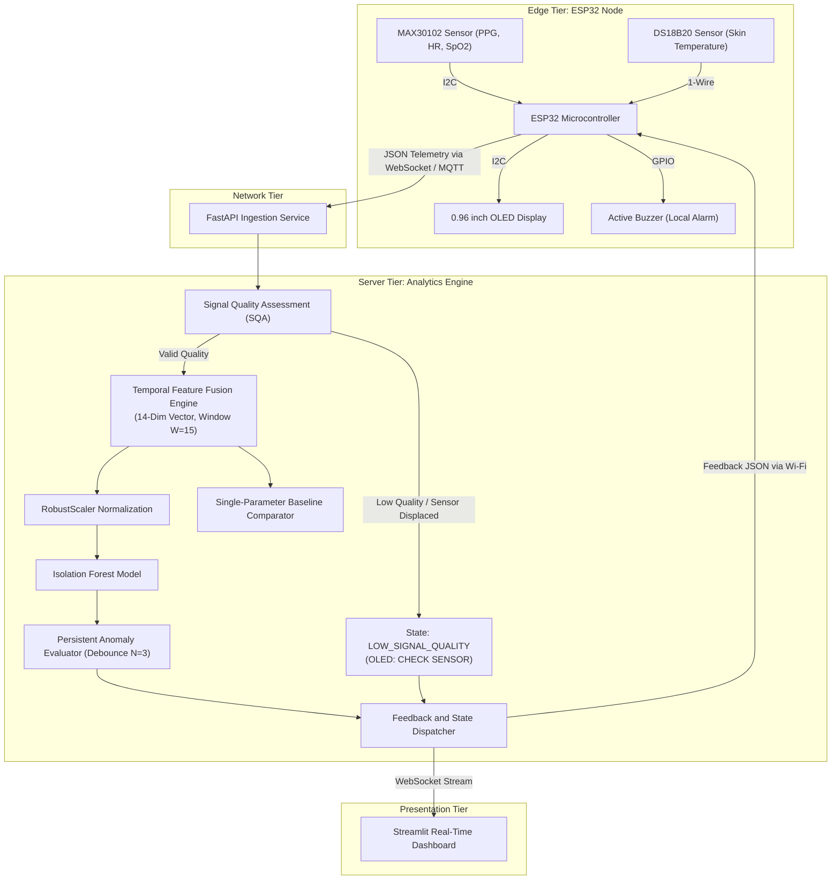

# IoT-Based Physiological Parameter Monitoring and Anomaly Detection

[](https://www.python.org/)
[](https://platformio.org/)
[](https://fastapi.tiangolo.com/)
[](https://streamlit.io/)
[](https://scikit-learn.org/)
[]()

IoT-based physiological parameter monitoring and unsupervised multivariate anomaly detection system using optical Photoplethysmogram (PPG), Blood Oxygen Saturation (SpO2), Skin Surface Temperature, and Isolation Forest.

---

> [!IMPORTANT]
> **NON-CLINICAL EARLY WARNING DISCLAIMER**: This system is an academic research prototype designed strictly for non-clinical early warning monitoring and feasibility evaluation. It is **NOT** a certified medical diagnostic device. The classification output "Deviating Pattern" denotes statistical deviation from baseline physiological distributions learned by the unsupervised model. It does not provide medical diagnoses for arrhythmia, tachycardia, bradycardia, hypoxia, hypothermia, fever, or related clinical conditions.

---

## System Overview

Wearable vital signs monitoring systems often suffer from high false alarm rates caused by motion artifacts, sensor displacement, and rigid single-parameter thresholding. This project implements an integrated edge-to-server architecture that addresses these limitations through:

1. **Multi-Sensor Acquisition**: Real-time optical PPG, estimated Heart Rate (HR), and SpO2 via the MAX30102 sensor, paired with digital skin surface temperature measurement via DS18B20.
2. **Rule-Based Signal Quality Assessment (SQA)**: Real-time validation of raw sensor data (valid physiological boundaries, sudden jump limits, PPG pulsatile amplitude, and flatline detection) before feature extraction.
3. **Temporal Feature Fusion (14-Dimensional Vector)**: Rolling window extraction combining instantaneous readings, first-order temporal differences (Delta), moving averages, variance, and composite rate of change.
4. **Unsupervised Anomaly Detection**: Isolation Forest model trained on normal physiological distributions, evaluating multivariate deviations without requiring labeled pathology training data.
5. **Persistent Anomaly Debouncing**: Local acoustic alert (active buzzer) triggers only after consecutive anomaly detections over a configurable debounce window ($N = 3$), eliminating transient spikes.
6. **Edge Autonomy & Dual Feedback**: Local 0.96-inch OLED displays live readings and system states (`NORMAL`, `CHECK SENSOR`, `ANOMALY`). If network connectivity fails, the ESP32 node continues local monitoring and display updates.

---

## Hardware Specifications and Wiring

The prototype consists of an ESP32 edge microcontroller interfaced with dedicated physiological sensors and local output peripherals:

| Component | Interface / Protocol | ESP32 GPIO Pin | Description |
| :--- | :--- | :---: | :--- |
| **MAX30102 SDA** | I2C Data | GPIO 21 | PPG, Heart Rate, and SpO2 sensor data |
| **MAX30102 SCL** | I2C Clock | GPIO 22 | PPG, Heart Rate, and SpO2 sensor clock |
| **SSD1306 OLED SDA** | I2C Data | GPIO 21 | Shared I2C bus (Address: 0x3C) |
| **SSD1306 OLED SCL** | I2C Clock | GPIO 22 | Shared I2C bus (Address: 0x3C) |
| **DS18B20 Data** | 1-Wire Digital | GPIO 4 | Skin surface temperature probe (4.7k Ohm pull-up to 3.3V) |
| **Active Buzzer** | Digital Output | GPIO 25 | Local audible alarm for persistent anomalies |
| **Power Supply** | DC Power | 3.3V / GND | Regulated system power |

---

## System Architecture

The end-to-end data pipeline routes data from the physical edge sensors through local processing, network ingestion, server-side inference, and visualization:



---

## 14-Dimensional Feature Vector Specification

For each sliding window ($W = 15$ samples), the Feature Fusion engine computes a 14-dimensional feature vector:

$$\mathbf{X} = [x_1, x_2, \dots, x_{14}]$$

| Index | Feature Identifier | Mathematical Definition | Physiological Significance |
| :---: | :--- | :--- | :--- |
| $x_1$ | `Heart_Rate` | $HR_t$ | Instantaneous heart rate (BPM) |
| $x_2$ | `SpO2` | $SpO2_t$ | Instantaneous peripheral blood oxygenation (%) |
| $x_3$ | `Temperature` | $Temp_t$ | Instantaneous skin surface temperature (°C) |
| $x_4$ | `Heart_Rate_Delta` | $HR_t - HR_{t-1}$ | Immediate pulse velocity change |
| $x_5$ | `SpO2_Delta` | $SpO2_t - SpO2_{t-1}$ | Immediate oxygenation trend |
| $x_6$ | `Temperature_Delta` | $Temp_t - Temp_{t-1}$ | Immediate thermal trend |
| $x_7$ | `MA_Heart_Rate` | $\frac{1}{W} \sum_{i=0}^{W-1} HR_{t-i}$ | Rolling baseline heart rate |
| $x_8$ | `MA_SpO2` | $\frac{1}{W} \sum_{i=0}^{W-1} SpO2_{t-i}$ | Rolling baseline oxygen saturation |
| $x_9$ | `MA_Temperature` | $\frac{1}{W} \sum_{i=0}^{W-1} Temp_{t-i}$ | Rolling baseline skin temperature |
| $x_{10}$ | `Var_Heart_Rate` | $\sigma^2_{HR}(W)$ | Heart rate stability / short-term variability |
| $x_{11}$ | `Var_SpO2` | $\sigma^2_{SpO2}(W)$ | Oxygen stability |
| $x_{12}$ | `Var_Temperature` | $\sigma^2_{Temp}(W)$ | Thermal stability |
| $x_{13}$ | `Rate_of_Change` | $\frac{\|\Delta HR\|}{\bar{HR}} + \frac{\|\Delta SpO2\|}{\bar{SpO2}} + \frac{\|\Delta Temp\|}{\bar{Temp}}$ | Normalized composite rate of physiological change |
| $x_{14}$ | `Signal_Quality_Score` | $SQA \in [0.0, 1.0]$ | SQA confidence coefficient |

---

## Machine Learning Model and Evaluation (Phase 1)

### Dataset Harmonization
The model was trained on 4 harmonized physiological datasets totaling **291,543 clean records**:
- `engrarri21` (Human Vital Signs): Benchmark clinical dataset with binary ground-truth labels.
- `nasirayub2` (Human Vital Signs 2024): Continuous time-series baseline volume.
- `rishanmascarenhas` (COVID-19 Vitals): Normalized with Fahrenheit-to-Celsius conversion.
- `gourangomandal` (IoMT Synthetic Dataset): Multi-parameter alert ground-truth with disease condition metadata.

### Model Hyperparameters
- **Algorithm**: `sklearn.ensemble.IsolationForest`
- **Number of Estimators**: 150
- **Contamination Factor**: 0.08
- **Normalization**: `RobustScaler` (quantile-based, outlier-resistant)
- **Training Population**: 129,113 normal physiological samples (unsupervised)

### Detection Performance across Health Conditions (Gourango Mandal Dataset)

| Health Category | Total Samples | Detected Normal | Detected Anomaly | Anomaly Detection Rate | Clinical / Physiological Interpretation |
| :--- | :---: | :---: | :---: | :---: | :--- |
| **Healthy** | 11,973 | 11,971 | 2 | **0.02%** | Ultra-low False Alarm rate during normal rest |
| **Asthma** | 11,885 | 8,597 | 3,288 | **27.67%** | Sensitive to oxygen desaturation (Mean SpO2: 88.98%) |
| **Heart Disease** | 12,038 | 9,642 | 2,396 | **19.90%** | Sensitive to tachycardia (Mean HR: 119.59 BPM) |
| **Diabetes Mellitus** | 12,164 | 11,822 | 342 | **2.81%** | Optical vitals remain largely within normal limits |
| **Hypertension** | 11,926 | 11,696 | 230 | **1.93%** | HR and SpO2 normal (pathology is in blood pressure) |

*Full evaluation metrics and confusion matrices are documented in [FASE_1_REPORT.md](FASE_1_REPORT.md).*

---

## Repository Structure

```text
.
├── ARCHITECTURE.md              # Technical architecture and payload contracts
├── FASE_1_REPORT.md             # Detailed Phase 1 execution and evaluation report
├── PROPOSAL.md                  # Complete proposal transcript
├── README.md                    # Project documentation and user guide
├── REQUIREMENTS.md              # Functional and non-functional requirements
├── ROADMAP.md                   # Six-phase implementation roadmap
├── SECURITY.md                  # Security, privacy, and hardware safety policies
│
├── backend/                     # FastAPI backend and inference service
│   ├── app/
│   │   ├── main.py              # Server application and WebSocket endpoints
│   │   ├── core/config.py       # Configuration and threshold definitions
│   │   ├── schemas/telemetry.py # Pydantic data contract schemas
│   │   └── services/            # SQA, Feature Fusion, and Anomaly Model services
│   └── requirements.txt         # Backend Python dependencies
│
├── dashboard/                   # Streamlit PC visualization dashboard
│   ├── app.py                   # Real-time multi-metric visualization application
│   └── requirements.txt         # Dashboard Python dependencies
│
├── firmware/                    # ESP32 embedded firmware (PlatformIO / C++)
│   ├── platformio.ini           # PlatformIO project configuration and libraries
│   ├── include/                 # Pinout, sensor, display, and client headers
│   └── src/                     # Non-blocking modular C++ implementations
│
├── ml_pipeline/                 # Machine learning training and data pipeline
│   ├── data/                    # Cleaned datasets and feature matrices
│   ├── models/                  # Serialized models (isolation_forest_model.joblib, scaler.joblib)
│   └── src/                     # Preprocessing, feature engineering, and training scripts
│
└── tests/                       # Automated pytest test suites
    ├── conftest.py              # Shared fixtures and mock telemetry data
    ├── test_features.py         # Feature fusion and windowing tests
    ├── test_model.py            # Model inference and persistent evaluator tests
    └── test_sqa.py              # Signal Quality Assessment boundary tests
```

---

## Quickstart Guide

### 1. Prerequisites
- Python 3.10+
- PlatformIO Core or PlatformIO IDE (VS Code extension)
- Git

### 2. Clone Repository
```bash
git clone https://github.com/Rnvz/IoT-based-Physiological-Parameter-Monitoring-and-Anomaly-Detection.git
cd IoT-based-Physiological-Parameter-Monitoring-and-Anomaly-Detection
```

### 3. Run the Machine Learning Pipeline (Phase 1)
```bash
cd ml_pipeline
pip install -r requirements.txt
python src/clean_datasets.py
python src/feature_engineering.py
python src/train_isolation_forest.py
```

### 4. Run the Backend Service (FastAPI)
```bash
cd ../backend
pip install -r requirements.txt
cp .env.example .env
uvicorn app.main:app --reload --host 0.0.0.0 --port 8000
```
Interactive API documentation is accessible at `http://localhost:8000/docs`.

### 5. Run the Visualization Dashboard (Streamlit)
```bash
cd ../dashboard
pip install -r requirements.txt
streamlit run app.py
```
The dashboard interface will open at `http://localhost:8501`.

### 6. Run Test Suites
```bash
# Execute from project root
python -m pytest tests/ -v
```

### 7. Compile and Flash ESP32 Firmware
```bash
cd firmware
cp include/secrets.h.example include/secrets.h
# Edit include/secrets.h with Wi-Fi credentials and server IP
pio run --target upload
pio device monitor
```

---

## Technical Documentation Links

- [ARCHITECTURE.md](ARCHITECTURE.md) - System architecture and JSON contract specifications.
- [FASE_1_REPORT.md](FASE_1_REPORT.md) - Comprehensive Phase 1 experimental report.
- [REQUIREMENTS.md](REQUIREMENTS.md) - Functional, non-functional, and boundary requirements.
- [ROADMAP.md](ROADMAP.md) - Implementation roadmap across six project phases.
- [SECURITY.md](SECURITY.md) - Authentication, data privacy, and buzzer safety limits.
- [PROPOSAL.md](PROPOSAL.md) - Original project proposal document.
