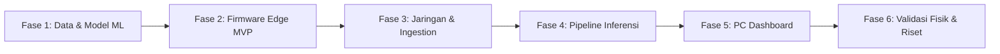

# ROADMAP: Rencana Pengembangan Sistem Deteksi Anomali Fisiologis IoT

Dokumen ini memetakan tahapan pengembangan sistem, daftar tugas per komponen, dan urutan prioritas kerja yang terstruktur dari tahap pondasi hingga pengujian eksperimental.

---

## 1. Rencana Fase Pengembangan (Phased Development Plan)

---

### Fase 1: Pipeline Data & Pelatihan Model AI (Offline Foundation)
*Tujuan: Memastikan model Isolation Forest dan baseline threshold telah siap, teruji, dan tervalidasi menggunakan strategi multi-dataset sebelum perangkat keras dihubungkan.*

- [ ] **1.1 Akuisisi & Harmonisasi Multi-Dataset**:
  - Mengunduh/menyiapkan 3 dataset Kaggle:
    - [engrarri21/human-vital-signs](https://www.kaggle.com/datasets/engrarri21/human-vital-signs) (Dataset Primer Berlabel).
    - [nasirayub2/human-vital-sign-dataset](https://www.kaggle.com/datasets/nasirayub2/human-vital-sign-dataset) (Dataset Volume Besar Variasi Normal).
    - [rishanmascarenhas/covid19-temperatureoxygenpulse-rate](https://www.kaggle.com/datasets/rishanmascarenhas/covid19-temperatureoxygenpulse-rate) (Suplemen Fitur Numerik).
  - Mengintegrasikan data sintetis bertingkat [IEEE DataPort](https://ieee-dataport.org/) (*Synthetic Dataset for Patient Vitals Monitoring with Scenarios*).
  - Eliminasi kolom `RESP` (karena tidak ada sensor fisik pernapasan).
  - Harmonisasi penamaan kolom target: `Heart_Rate`, `SpO2`, `Temperature`.
  - Imputasi nilai kosong (*missing values*) dan filter anomali biologis tidak masuk akal.
- [ ] **1.2 Feature Engineering Temporal (Feature Fusion)**:
  - Ekstraksi fitur dinamika delta: $\Delta \text{HR}, \Delta \text{SpO}_2, \Delta \text{Temp}$.
  - Ekstraksi fitur runtun waktu *rolling window* ($W = 10-30$ s): Moving Average dan Variance.
  - Kalkulasi *Rate of Change* multi-parameter.
  - Normalisasi fitur menggunakan `RobustScaler` (tahan terhadap outlier fisiologis).
- [ ] **1.3 Pelatihan Unsupervised & Benchmarking Model**:
  - Pelatihan model `IsolationForest` menggunakan data sebaran normal gabungan (`nasirayub2` + pola normal `engrarri21` + suplemen `rishanmascarenhas`).
  - Pembuatan model pembanding *Simple Single-Parameter Threshold Baseline*.
  - Evaluasi multi-tier:
    1. Evaluasi biner terhadap ground-truth `engrarri21` (*Precision*, *Recall*, *F1-Score*, *Confusion Matrix*).
    2. Evaluasi bertingkat terhadap skenario anomali sintetis IEEE DataPort (5 kelas).
  - Serialisasi model dan scaler terlatih ke `ml_pipeline/models/isolation_forest_model.joblib`.

---

### Fase 2: Firmware & Sensor Prototyping (Edge MVP)
*Tujuan: Membangun perangkat fisik (Desktop Demo Testbed sebagai prioritas utama yang stabil, dengan opsi wearable wrist strap jika memungkinkan) yang mampu membaca sensor secara andal dan menampilkan hasil pada layar OLED lokal.*

- [ ] **2.1 Setup Project PlatformIO & Physical Testbed**:
  - Inisialisasi struktur project C++ untuk board `esp32dev`.
  - Konfigurasi dependensi library: `SparkFun MAX3010x`, `PaulStoffregen/OneWire`, `DallasTemperature`, `Adafruit SSD1306`, `Adafruit GFX`.
  - Perakitan fisik Tier 1: Desktop Breadboard / Demo Station (ESP32, OLED, Buzzer di meja; probe MAX30102 via fingertip clip dan probe DS18B20).
- [ ] **2.2 Integrasi Sensor MAX30102 (PPG / HR / SpO₂)**:
  - Inisialisasi bus I²C, konfigurasi sample rate, LED pulse amplitude, dan mode deteksi denyut.
  - Pengujian pembacaan pada ujung jari (sinyal stabil/SNR tinggi) dan pergelangan tangan.
  - Logika pendeteksi kontak kulit (apabila jari/pergelangan tidak terpasang, flag status `CEK SENSOR`).
- [ ] **2.3 Integrasi Sensor DS18B20 (Suhu Kulit)**:
  - Pembacaan suhu digital non-blocking berbasis sensor 1-Wire via probe sentuh kulit.
- [ ] **2.4 Manajemen Tampilan OLED I²C**:
  - Desain layout tampilan sesuai proposal: baris HR, SpO₂, TEMP, dan STATUS (`NORMAL`, `CEK SENSOR`, `ANOMALI`).
  - Refresh rate adaptif tanpa menggunakan `delay()`.
- [ ] **2.5 Integrasi Buzzer Aktif**:
  - Uji kendali pin GPIO buzzer aktif.
  - Implementasi *safety timeout* (pemutus buzzer otomatis untuk mencegah alarm menyala tanpa henti).
- [ ] **2.6 Edge Standalone Mode**:
  - Memastikan firmware tetap dapat berjalan mandiri menampilkan parameter di OLED jika belum ada koneksi Wi-Fi.

---

### Fase 3: Konektivitas Nirkabel & Backend Ingestion
*Tujuan: Mengalirkan data dari mikrokontroler ke server lokal secara stabil dan real-time.*

- [ ] **3.1 Modul Jaringan ESP32**:
  - Koneksi Wi-Fi dengan *exponential backoff auto-reconnect*.
  - Serialisasi data sensor ke payload JSON telemetri.
  - Implementasi klien transmisi (MQTT / WebSocket).
- [ ] **3.2 Backend Service (FastAPI / MQTT Consumer)**:
  - Inisialisasi broker MQTT (Mosquitto) atau server FastAPI WebSocket.
  - Endpoint / topik penerima telemetri dengan validasi skema data (Pydantic).
- [ ] **3.3 Modul Signal Quality Assessment (SQA)**:
  - Algoritma verifikasi stabilitas sinyal optik PPG (amplitudo LED, rasio AC/DC dasar).
  - Penandaan status: `GOOD` vs `POOR_QUALITY`.
  - Jika `POOR_QUALITY`, tandai sebagai `CEK SENSOR` dan tangguhkan inferensi ML.

---

### Fase 4: Pipeline Inferensi Real-Time & Feedback Loop
*Tujuan: Memproses fitur temporal secara streaming dan mengirimkan umpan balik status kembali ke ESP32.*

- [ ] **4.1 Ring Buffer & Temporal Extractor**:
  - Implementasi *in-memory sliding window* (10–30 sampel) untuk setiap device session.
  - Kalkulasi fitur delta, moving average, variance, dan rate of change secara real-time per detik.
- [ ] **4.2 Real-time ML Inference**:
  - Memuat model `isolation_forest_model.joblib`.
  - Prediksi kelas anomali dan kalkulasi *anomaly score*.
- [ ] **4.3 Persistent Anomaly Evaluator (Debounce)**:
  - Penghitung (*counter*) consecutive anomaly: hanya mengaktifkan status `POLA MENYIMPANG` jika anomali konsisten selama $N$ sampel berturut-turut ($N=3-5$).
- [ ] **4.4 Feedback Dispatcher ke ESP32**:
  - Pengiriman balik payload JSON status (`NORMAL` / `ANOMALI` / `CEK SENSOR`, flag `buzzer_active`) ke ESP32 via Wi-Fi.
  - ESP32 menerima payload dan mengupdate OLED serta membunyikan buzzer bila diinstruksikan.

---

### Fase 5: PC Dashboard & Monitoring UI
*Tujuan: Menyediakan antarmuka visual interaktif bagi operator di laptop/PC.*

- [ ] **5.1 Setup Dashboard Real-Time**:
  - Implementasi aplikasi dashboard (Streamlit dengan auto-refresh atau Web UI berbasis WebSocket).
- [ ] **5.2 Komponen Visualisasi**:
  - Kartu metrik terkini: Heart Rate (BPM), SpO₂ (%), Suhu Kulit (°C).
  - Grafik tren dinamis (*time-series multi-line chart*).
  - Gauge / indikator *Anomaly Score* dan *Signal Quality Score*.
  - Badge status sistem (`NORMAL`, `POLA MENYIMPANG`, `KUALITAS SINYAL RENDAH`).
  - Panel konektivitas (status koneksi ESP32, IP, latency milidetik).
- [ ] **5.3 Log Sesi Eksperimen**:
  - Fitur ekspor rekaman pengujian ke format CSV untuk analisis pasca-eksperimen.

---

### Fase 6: Validasi Eksperimental & Pengujian Sesuai Proposal
*Tujuan: Menguji performa sistem pada skenario fisik non-klinis dan menghasilkan metrik evaluasi ilmiah.*

- [ ] **6.1 Eksekusi Skenario Pengujian Fisik**:
  - Uji Kondisi Istirahat (*baseline resting state*).
  - Uji Aktivitas Mengetik (*keyboard typing motion artifact*).
  - Uji Aktivitas Fisik Ringan (berdiri, berjalan santai).
  - Uji Variasi Posisi Tangan & Sensor pada pergelangan.
  - Uji Variasi Tekanan *Wrist Strap* (kendor vs pas).
  - Uji Kontak Sensor Tidak Stabil (simulasi sensor bergeser/terangkat).
- [ ] **6.2 Pengukuran Metrik Sistem IoT**:
  - Pengukuran *end-to-end latency* (ms).
  - Pengukuran *packet loss* (%) selama sesi uji kontinu 15–30 menit.
  - Evaluasi stabilitas pembacaan sensor (drift & noise).
- [ ] **6.3 Analisis Komparasi Model vs Baseline**:
  - Perbandingan sensitivitas Isolation Forest vs Single-Parameter Threshold.
  - Verifikasi efektivitas SQA dalam menekan *false alarm* saat sensor bergeser.

---

## 2. Matriks Tugas Berdasarkan Komponen

| Komponen | Tugas Utama | Prioritas | Dependensi |
| :--- | :--- | :---: | :--- |
| **ML & Data** | Pembersihan Dataset 1 & 2, Feature Engineering | **P1 (Tertinggi)** | File dataset sekunder |
| **ML & Data** | Pelatihan Isolation Forest & Threshold Baseline | **P1** | Dataset bersih |
| **Firmware** | Driver Sensor (MAX30102, DS18B20) & OLED | **P1** | Hardware ESP32 & modul |
| **Firmware** | Modul Wi-Fi & Klien Telemetri | **P2** | Driver sensor selesai |
| **Backend** | Ingestion Server & Pipeline SQA | **P2** | Skema data disepakati |
| **Backend** | Sliding Window Feature Engine & ML Inference | **P2** | Model Fase 1 & Ingestion Fase 3 |
| **Dashboard**| UI Visualisasi Time-Series & Status | **P3** | Backend pipeline siap |
| **Hardware** | Integrasi Fisik Testbed Demo (Tier 1) & Wearable Wrist Strap (Tier 2 Opsional) | **P3** | Hardware terpasang |
| **Riset/Uji**| Eksekusi 7 Skenario Pengujian Fisik | **P4** | Sistem end-to-end terintegrasi |

---

## 3. Urutan Prioritas Pengerjaan Awal

1. **Langkah 1**: Bersihkan dataset dan latih model `IsolationForest` secara offline (memvalidasi konsep *feature fusion* pada data nyata).
2. **Langkah 2**: Tulis dan uji firmware lokal ESP32 (membaca sensor dan menampilkan ke OLED tanpa Wi-Fi terlebih dahulu).
3. **Langkah 3**: Bangun backend FastAPI + SQA dan hubungkan ESP32 via Wi-Fi.
4. **Langkah 4**: Gabungkan inferensi ML dan feedback status ke buzzer & OLED.
5. **Langkah 5**: Bangun dashboard visualisasi PC dan mulai eksperimen skenario fisik.
